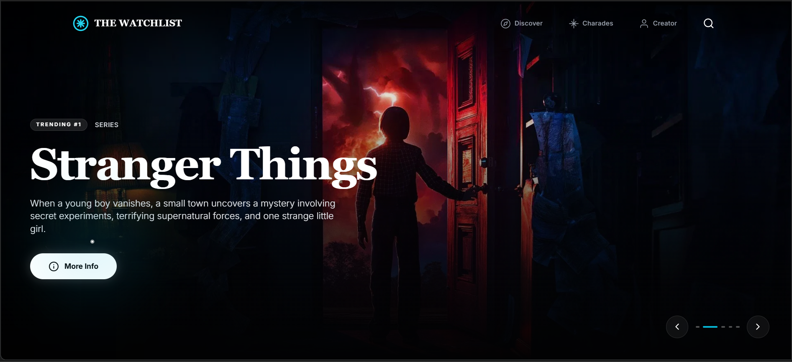
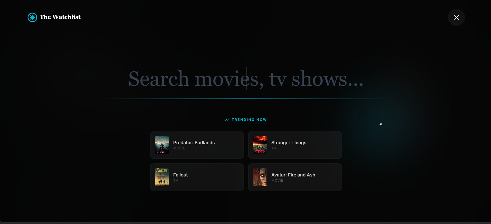
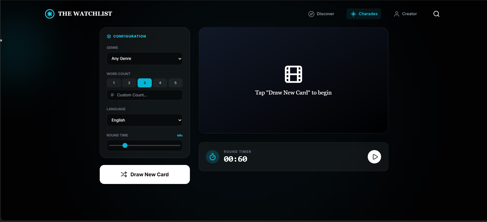

# The Watchlist

An ultra-cinematic TMDB explorer built for late-night scrolling: bold typography, motion-first UI, and a set of playful utilities (Mood Recommender + Charades) that make discovery feel like a trailer.

---

## Table of Contents

- Overview
- Features
- Live Demo / Preview
- Screenshots
- Tech Stack
- Project Structure
- Routes
- Environment Variables
- Local Development
- Production Build
- Deployment Notes
- Troubleshooting
- Data & Attribution
- Creator

---

## Overview

**The Watchlist** is a single-page React app powered by TMDB. It focuses on *vibe* and *velocity*: quick discovery, smooth transitions, and a layout that reads like a film poster wall.

Whether you want something trending right now, a random charades prompt for game night, or a mood-based pick when your brain is done choosing—this app is built to keep you watching.

---

## Features

- **Trending & Popular Discovery**: Explore what’s hot across movies/TV.
- **Fast Search Overlay**: Type, scan, jump—no page reloads.
- **Mood Recommender**: Choose a mood, tune filters, and get curated results.
- **Charades Mode**: Generate movie titles as prompts (with language/genre controls).
- **Cinematic Details View**: Trailer links, credits, similar picks, poster actions.
- **Polished Motion**: UI motion via Framer Motion for a premium feel.

---

## Live Demo / Preview

- Live: https://project-watchlist.netlify.app/
- Repo: https://github.com/sharmaram25/The-Watchlist
- Local dev: `npm run dev`
- Local preview: `npm run preview`

---

## Screenshots

Latest captures:






---

## Tech Stack

- **React 19**
- **TypeScript**
- **Vite**
- **React Router**
- **Framer Motion**
- **Lucide Icons**
- **D3** (for any data-driven visuals / UI support used in the project)

---

## Project Structure

High-level map:

- `App.tsx` — Router + layout shell
- `pages/` — Route pages (Home, Details, Recommender, Charades, etc.)
- `components/` — UI building blocks (Navbar, MovieCard, CustomCursor, Footer)
- `services/` — Data access layer (TMDB fetch helpers)
- `constants.ts` — Shared constants (image base URLs, mood/genre mapping)
- `types.ts` — Shared TypeScript types

---

## Routes

Core routes:

- `/` — Home (discovery/trending)
- `/recommender` — Mood recommender
- `/charades` — Charades tool
- `/about` — Creator page
- `/details/:type/:id` — Details page (`type` is `movie` or `tv`)
- `/category/:category` — Category collections

---

## Environment Variables

This project uses a Vite-style environment variable:

- `VITE_TMDB_API_KEY` — Your TMDB v3 API key

Create a `.env.local` file (or edit your existing one):

```bash
VITE_TMDB_API_KEY=YOUR_TMDB_API_KEY
```

You can also start from the example file:

- `.env.example`

Important note: Any API key used directly in a client-side app can be discovered by end users. If you need stronger protection, proxy TMDB via a small backend (serverless function / API route) and keep secrets server-side.

---

## Local Development

### 1) Install dependencies

```bash
npm install
```

### 2) Add your environment variable

```bash
VITE_TMDB_API_KEY=YOUR_TMDB_API_KEY
```

### 3) Run the dev server

```bash
npm run dev
```

---

## Production Build

Build an optimized bundle:

```bash
npm run build
```

Preview the production build locally:

```bash
npm run preview
```

Vite outputs the final static site in `dist/`.

---

## Deployment Notes

You can deploy `dist/` to any static host:

- **Netlify**: set build command to `npm run build` and publish directory to `dist`
- **Vercel**: framework preset “Vite”, output `dist`
- **GitHub Pages**: also works; consider switching from `HashRouter` only if you configure SPA rewrites

---

## Troubleshooting

### Blank data / request failures

- Ensure `VITE_TMDB_API_KEY` is set.
- If the UI loads but results are empty, check the browser console for fetch errors.

### CORS / image download

Some direct image downloads may be blocked by CORS depending on asset headers. The app falls back to opening the image in a new tab when direct download isn’t allowed.

### Port already in use

If `3000` is occupied, Vite will automatically try another port.

---

## Data & Attribution

This product uses the **TMDB API** but is not endorsed or certified by TMDB.

---

## 👨‍💻 **Meet The Creator**


### **Ram Sharma**
*Full-Stack Developer & Cinema Enthusiast*

**🚀 Passionate about creating exceptional user experiences**  
**🎬 Combining technology with entertainment magic**  
**✨ Building the future of movie discovery**

<div align="center">

[](https://github.com/sharmaram25)
[](https://www.linkedin.com/in/ram-sharma-20rs02)
[](https://www.instagram.com/ramsharma.25)
[](mailto:sharmaram2504@gmail.com)


- Portfolio: https://portfolio-ram-sharma.netlify.app/
- Email: sharmaram2504@gmail.com

</div>

---

## 🌟 **Show Your Support**

If The WatchList has enhanced your movie discovery journey, please consider:

<div align="center">

**⭐ Star this repository**  
**🐛 Report issues to help us improve**  
**💡 Suggest features in discussions**  
**📢 Share with fellow movie lovers**  
**🤝 Contribute to the codebase**

</div>


---

<div align="center">

### 🎬 **Happy Watching! 🍿**


**Built with ❤️ for movie and TV show enthusiasts everywhere**

*"Every great film begins with a single frame. Every great app begins with a single commit."*  
**— Ram Sharma, Creator of The WatchList**

---

**🌟 Made with passion, precision, and popcorn 🍿**

</div>
