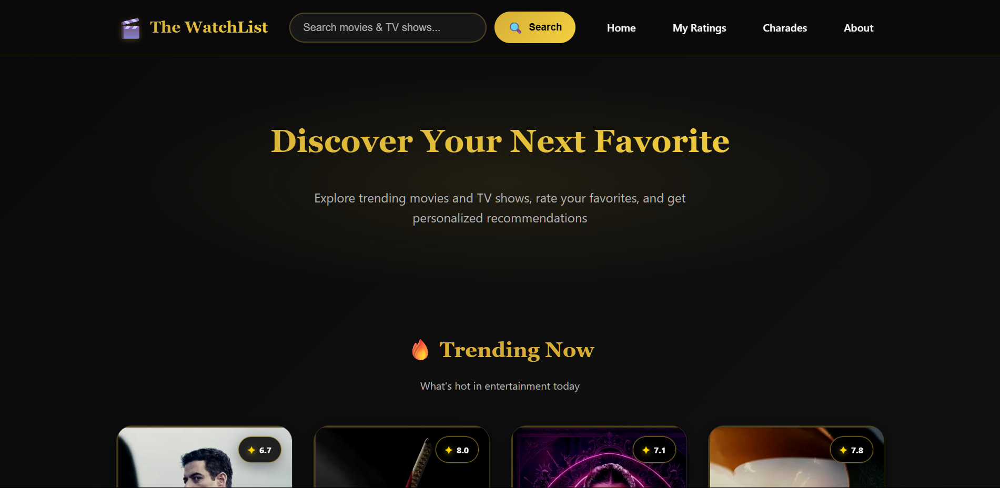
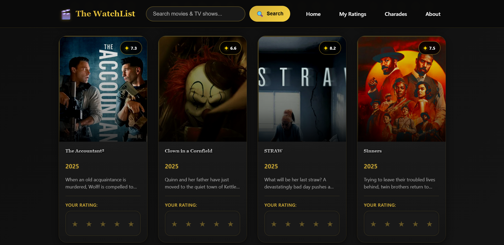
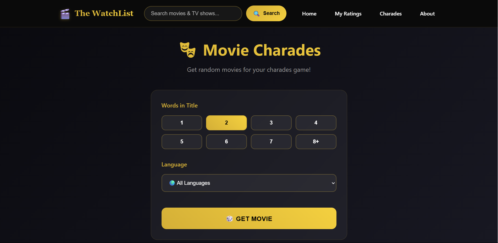
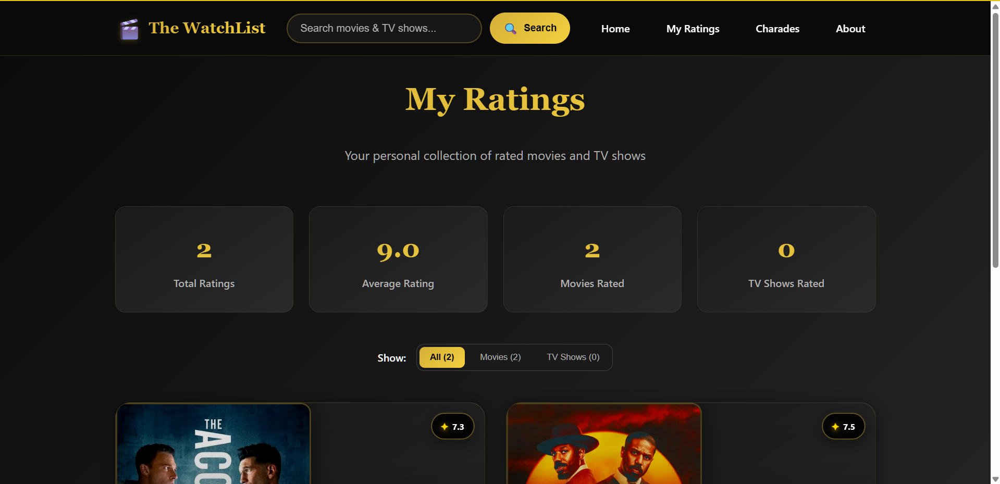
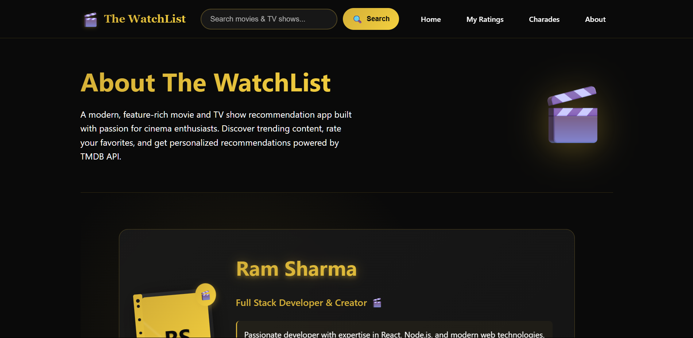
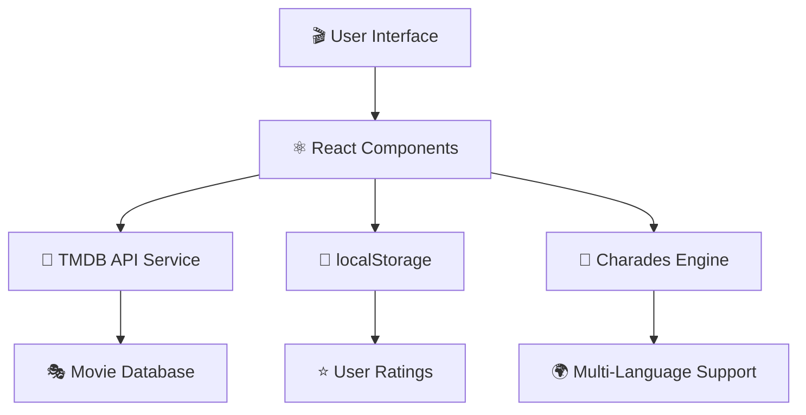

<div align="center">

# 🎬 The WatchList

[](https://reactjs.org/)
[](https://www.themoviedb.org/documentation/api)
[](https://netlify.com/)
[](LICENSE)

### *Where Cinema Meets Technology* ✨

**A breathtaking, cinematic Movie & TV Show Recommendation App** crafted with passion for entertainment enthusiasts worldwide. Experience the magic of discovering trending content, rating your favorites, playing movie charades, and receiving AI-powered recommendations.

---

## 🌟 **Experience The Magic**

<table>
<tr>
<td width="50%">


**🏠 Cinematic Homepage**
*Immersive hero section with trending content*

</td>
<td width="50%">


**🎭 Beautiful Movie Cards**
*Elegant design with interactive rating system*

</td>
</tr>
<tr>
<td width="50%">


**🎯 Movie Charades Game**
*Unique feature with 17+ language support*

</td>
<td width="50%">


**⭐ Personal Rating System**
*Track your viewing habits and preferences*

</td>
</tr>
<tr>
<td colspan="2" align="center">


**👨‍💻 Meet The Creator**
*Personal touch with elegant about section*

</td>
</tr>
</table>

</div>

---

<div align="center">

## ✨ **Features That Define Excellence**

*Every feature crafted with attention to detail and user experience*

</div>

### 🏠 **Immersive Homepage Experience**
- **🔥 Trending Spotlight** - Discover what's capturing the world's attention
- **🎬 Popular Movies** - Curated selection of must-watch films
- **📺 Binge-Worthy TV Shows** - Find your next obsession
- **⭐ Critically Acclaimed** - Explore award-winning masterpieces
- **🌅 Cinematic Hero Section** - Stunning gradients with golden luxury accents
- **✨ Smooth Animations** - Butter-smooth micro-interactions throughout

### 🔍 **Intelligent Search System**
- **🧠 Multi-Type Search** - Movies, TV shows, or both with smart algorithms
- **⚡ Real-Time Results** - Instant search with intelligent filtering
- **♾️ Infinite Scroll** - Seamless content loading without interruption
- **🎨 Beautiful Interface** - Elegant search experience with visual feedback
- **🔄 Advanced Filters** - Refine results by type, year, rating, and more

### 🎭 **Rich Content Discovery**
- **🎬 Comprehensive Movie Pages** - Cast, crew, trailers, budgets, box office, and trivia
- **📺 Detailed TV Show Pages** - Seasons, episodes, creators, networks, and episode guides  
- **⭐ Personal Rating System** - Rate content on a 1-10 scale with visual stars
- **🤖 AI-Powered Recommendations** - Smart suggestions based on your viewing patterns
- **🖼️ High-Quality Media** - Stunning 4K posters, backdrops, and YouTube trailer integration
- **🎥 Behind-the-Scenes** - Production companies, filming locations, and insider information

### 🎯 **Movie Charades Game** *(Signature Feature)*
> *The world's most sophisticated movie charades generator*

- **🎲 Smart Word Selection** - Choose movies with 1-8+ words for perfect difficulty
- **🌍 Global Language Support** - 17+ languages including:
  ```
  🇺🇸 English    🇮🇳 Hindi      🇮🇳 Tamil      🇮🇳 Telugu     🇮🇳 Bengali
  🇪🇸 Spanish    🇫🇷 French     🇩🇪 German     🇮🇹 Italian    🇵🇹 Portuguese  
  🇯🇵 Japanese   🇰🇷 Korean     🇨🇳 Chinese    🇸🇦 Arabic     🇷🇺 Russian
  🇳🇱 Dutch      🇸🇪 Swedish    And many more...
  ```
- **🎮 Perfect for Parties** - Instant entertainment for groups and families
- **📱 Mobile Optimized** - Smooth experience on all devices
- **🎭 Intelligent Algorithm** - Balanced mix of popular and classic films

### ⭐ **Personal Entertainment Dashboard**
- **📊 Advanced Analytics** - Deep insights into your viewing habits
- **🏷️ Smart Filtering** - View ratings by movies, TV shows, genres, or time periods
- **👑 Rating Streaks** - Track your rating consistency and discover patterns
- **🎯 Personalized Stats** - Average ratings, favorite genres, and viewing trends
- **💾 Persistent Storage** - Your data safely stored locally, never lost

### 🎨 **Award-Winning Design**
- **🌑 Luxurious Dark Theme** - Reduces eye strain with premium aesthetics
- **✨ Golden Accent System** - Inspired by Hollywood glamour and cinema luxury
- **📱 Responsive Excellence** - Flawless experience on mobile, tablet, and desktop
- **🎭 Typography Mastery** - Carefully chosen fonts for maximum readability
- **♿ Accessibility First** - WCAG compliant with keyboard navigation and screen readers
- **🌊 Fluid Animations** - Physics-based transitions that feel natural

---

<div align="center">

## 🚀 **Quick Start Guide**

*Get up and running in under 2 minutes*

</div>

### 📋 **Prerequisites**
```bash
✅ Node.js (v18 or higher)    📦 npm or yarn    🔑 TMDB API Key (Free)
```

<div align="center">

### 🎯 **Lightning-Fast Installation**

</div>

<table>
<tr>
<td width="50%">

#### **🔥 Method 1: One-Click Setup**
```bash
# Clone the magic
git clone https://github.com/sharmaram25/the-watchlist.git
cd the-watchlist

# Windows users
.\setup.bat

# Mac/Linux users  
chmod +x setup.sh && ./setup.sh
```

</td>
<td width="50%">

#### **⚡ Method 2: Manual Setup**
```bash
# Step 1: Clone repository
git clone https://github.com/sharmaram25/the-watchlist.git
cd the-watchlist

# Step 2: Install dependencies
cd client && npm install

# Step 3: Environment setup
echo "REACT_APP_TMDB_API_KEY=your_key_here" > .env

# Step 4: Launch the experience
npm start
```

</td>
</tr>
</table>

<div align="center">

### 🌐 **Launch The Experience**
Open your browser and navigate to `http://localhost:3000`

**🎉 Welcome to The WatchList!**

</div>

---

<div align="center">

## 🏗️ **Technical Excellence**

*Built with cutting-edge technologies and best practices*

</div>

### **🎯 Architecture Overview**

<table>
<tr>
<td width="33%">

#### **⚛️ Frontend Stack**
```javascript
React 19.1.0      // Modern hooks & components
Router Dom 7.6.2  // Client-side routing  
CSS3 Grid/Flexbox // Responsive layouts
ES6+ JavaScript   // Latest language features
```

</td>
<td width="33%">

#### **🔌 API Integration** 
```javascript
TMDB API v3       // Movie database
Direct Fetch API  // No backend required
localStorage      // Client persistence
Error Boundaries  // Graceful failures
```

</td>
<td width="33%">

#### **🎨 Design System**
```css
Dark Theme        // Eye-friendly interface
Golden Accents    // Luxury aesthetics  
Mobile-First      // Responsive design
WCAG Compliant    // Accessibility ready
```

</td>
</tr>
</table>

### **📁 Project Architecture**

```
🎬 The WatchList/
├── 📱 client/                     # React Frontend Application
│   ├── 🏗️ public/                # Static Assets & Meta Files
│   │   ├── 🎭 favicon.svg         # Custom cinema-themed favicon
│   │   ├── 🎪 movie-cursor.svg    # Interactive cursor design
│   │   └── 📄 manifest.json       # PWA configuration
│   │
│   ├── ⚛️ src/                    # Source Code Directory
│   │   ├── 🧩 components/         # Reusable UI Components
│   │   │   ├── 🎯 Header/         # Navigation & Search Bar
│   │   │   ├── 🎭 MovieCard/      # Interactive Content Cards
│   │   │   └── 🛡️ ErrorBoundary/  # Error Handling System
│   │   │
│   │   ├── 📄 pages/              # Route-Based Components
│   │   │   ├── 🏠 Home/           # Homepage Experience
│   │   │   ├── 🔍 Search/         # Search Results Page
│   │   │   ├── 🎬 MovieDetails/   # Movie Information Hub
│   │   │   ├── 📺 TVDetails/      # TV Show Information Hub
│   │   │   ├── ⭐ MyRatings/      # Personal Rating Dashboard
│   │   │   ├── 🎯 Charades/       # Movie Charades Game
│   │   │   └── 👨‍💻 About/         # Developer Information
│   │   │
│   │   ├── 🔧 services/           # API & Utility Services
│   │   ├── 🎨 App.css             # Global Styling System
│   │   └── ⚛️ App.js              # Main Application Component
│   │
│   └── 🏗️ build/                  # Production Build Output
│       ├── 📄 index.html          # Entry Point
│       └── 📁 static/             # Optimized Assets
│
├── 🌐 netlify.toml               # Deployment Configuration
├── 📋 package.json              # Project Dependencies
└── 📖 README.md                 # You Are Here!
```

### **🔄 Data Flow Architecture**


```mermaid
graph TD
    A[🎬 User Interface] --> B[⚛️ React Components]
    B --> C[🔌 TMDB API Service]
    C --> D[🎭 Movie Database]
    B --> E[💾 localStorage]
    E --> F[⭐ User Ratings]
    B --> G[🎯 Charades Engine]
    G --> H[🌍 Multi-Language Support]
```

---

<div align="center">

## 🎮 **User Experience Guide** 

*Master every feature like a pro*

</div>

<table>
<tr>
<td width="50%">

### **🏠 Content Discovery**
```
1. 🌟 Browse Homepage
   ├── Trending Now
   ├── Popular Movies  
   ├── Popular TV Shows
   └── Top Rated Content

2. 🔍 Advanced Search
   ├── Multi-type filtering
   ├── Real-time results
   └── Infinite scroll loading

3. 🎭 Detailed Exploration
   ├── Full cast & crew info
   ├── Trailers & media
   └── Production details
```

</td>
<td width="50%">

### **⭐ Personal Features**
```
1. 🎯 Rating System
   ├── 1-10 star scale
   ├── Visual feedback
   └── Instant saving

2. 📊 Rating Dashboard
   ├── Personal statistics
   ├── Filtering options
   └── Viewing trends

3. 🎮 Movie Charades
   ├── Word count selection
   ├── Language preferences
   └── Instant generation
```

</td>
</tr>
</table>

### **🎯 Movie Charades Mastery**

<div align="center">

**🎭 The Ultimate Party Game Generator**

</div>

1. **🎪 Navigate to Charades** - Click the golden "Charades" button in navigation
2. **🎲 Choose Difficulty** - Select movies with 1-8+ words for perfect challenge level
3. **🌍 Pick Your Language** - Choose from our extensive 17+ language collection
4. **🎬 Generate Movies** - Hit "Get Movie" for instantly curated film suggestions
5. **🎉 Start Playing** - Act out the movies and let the fun begin!

### **⭐ Rating System Pro Tips**

<div align="center">

**📊 Build Your Personal Cinema Database**

</div>

- **🎯 Quick Rating** - Hover over any movie card and rate with golden stars
- **📱 Mobile Rating** - Tap once to open rating, tap stars to rate
- **📊 Dashboard Insights** - Visit "My Ratings" for detailed analytics
- **🔄 Update Anytime** - Change ratings as your opinions evolve
- **💾 Never Lose Data** - All ratings saved locally and persist forever

---

<div align="center">

## 🚀 **Production Deployment**

*Ready for the world stage*

</div>

### **🌐 Netlify Deployment** *(Recommended)*

<table>
<tr>
<td width="60%">

#### **⚙️ Build Configuration**
```yaml
# Netlify Settings
Base Directory: client
Build Command: npm run build  
Publish Directory: client/build
Node Version: 18.x
```

#### **🔐 Environment Variables**
```bash
REACT_APP_TMDB_API_KEY=your_tmdb_api_key_here
```

</td>
<td width="40%">

#### **🎯 Deployment Steps**
```bash
1. 📁 Push to GitHub
2. 🔗 Connect to Netlify
3. ⚙️ Configure settings
4. 🔑 Add API key
5. 🚀 Deploy & celebrate!
```

#### **✅ Production Features**
- ⚡ Lightning-fast CDN
- 🔄 Automatic deployments  
- 🌍 Global edge network
- 📊 Analytics included

</td>
</tr>
</table>

### **🌟 Alternative Deployment Options**

<div align="center">

| Platform | Difficulty | Speed | Features |
|----------|------------|-------|----------|
| 🔥 **Netlify** | Easy | ⚡⚡⚡ | Auto-deploy, Forms, Analytics |
| ⚡ **Vercel** | Easy | ⚡⚡⚡ | GitHub integration, Preview URLs |
| 🌊 **Surge.sh** | Beginner | ⚡⚡ | Simple CLI deployment |
| 🐙 **GitHub Pages** | Medium | ⚡ | Free hosting, Custom domains |

</div>

### **🔧 Build Optimization**

```bash
# Create optimized production build
cd client
npm run build

# Build output analysis
├── 📄 index.html          # Entry point (2KB)
├── 📁 static/
│   ├── 🎨 css/           # Minified stylesheets  
│   ├── ⚡ js/            # Optimized JavaScript bundles
│   └── 🖼️ media/         # Compressed images & icons
└── 📊 asset-manifest.json # Build manifest
```

---

## 📱 Screenshots

### Homepage

*Stunning hero section with trending content*

### Movie Charades Game

*Fun movie guessing game with multi-language support*

### Personal Ratings Dashboard

*Track your viewing habits and preferences*

### Movie Cards & Content

*Beautiful movie cards with rating system*

---

## 📱 Screenshots

### Homepage

*Stunning hero section with trending content*

### Movie Charades Game

*Fun movie guessing game with multi-language support*

### Personal Ratings Dashboard

*Track your viewing habits and preferences*

### Movie Cards & Content

*Beautiful movie cards with rating system*

---

<div align="center">

## 🤝 **Contributing to Excellence**

*Join the mission to create the ultimate entertainment app*

</div>

### **🌟 How to Contribute**

<table>
<tr>
<td width="50%">

#### **🔥 Quick Contribution**
```bash
# Fork & clone
git clone https://github.com/sharmaram25/the-watchlist.git

# Create feature branch  
git checkout -b feature/amazing-feature

# Make your magic happen
# ... your brilliant code ...

# Commit with style
git commit -m '✨ Add amazing feature'

# Push to glory
git push origin feature/amazing-feature

# Create Pull Request
```

</td>
<td width="50%">

#### **🎯 Contribution Areas**
- 🎨 **UI/UX Improvements**
- ⚡ **Performance Optimizations**  
- 🌍 **Internationalization**
- 🎮 **New Game Features**
- 📊 **Analytics & Insights**
- 🔒 **Security Enhancements**
- 📱 **Mobile Experience**
- ♿ **Accessibility Features**

</td>
</tr>
</table>

### **🏆 Contribution Guidelines**

<div align="center">

**Code Quality Standards**

</div>

- ✅ **Follow existing code style** - Consistency is key
- 📝 **Write meaningful commit messages** - Tell the story
- 🧪 **Test your changes thoroughly** - Quality over speed  
- 📚 **Update documentation** - Help others understand
- 🎨 **Maintain design system** - Preserve the aesthetic
- 🚀 **Consider performance impact** - Every millisecond counts

---

<div align="center">

## 📄 **License & Legal**

</div>

This project is licensed under the **MIT License** - see the [LICENSE](LICENSE) file for complete details.

### **🙏 Acknowledgments**

<table>
<tr>
<td width="33%" align="center">

**🎭 TMDB API**  
*Comprehensive movie & TV data*

</td>
<td width="33%" align="center">

**⚛️ React Community**  
*Amazing framework & ecosystem*

</td>
<td width="33%" align="center">

**🎬 Cinema Enthusiasts**  
*Inspiration & feedback*

</td>
</tr>
</table>

---

<div align="center">

## 👨‍💻 **Meet The Creator**


### **Ram Sharma**
*Full-Stack Developer & Cinema Enthusiast*

**🚀 Passionate about creating exceptional user experiences**  
**🎬 Combining technology with entertainment magic**  
**✨ Building the future of movie discovery**

<div align="center">

[](https://github.com/sharmaram25)
[](https://www.linkedin.com/in/ram-sharma-20rs02)
[](https://www.instagram.com/ramsharma.25)
[](mailto:sharmaram2504@gmail.com)

</div>

---

## 🌟 **Show Your Support**

If The WatchList has enhanced your movie discovery journey, please consider:

<div align="center">

**⭐ Star this repository**  
**🐛 Report issues to help us improve**  
**💡 Suggest features in discussions**  
**📢 Share with fellow movie lovers**  
**🤝 Contribute to the codebase**

</div>

---

<div align="center">

### 🎬 **Happy Watching! 🍿**


**Built with ❤️ for movie and TV show enthusiasts everywhere**

*"Every great film begins with a single frame. Every great app begins with a single commit."*  
**— Ram Sharma, Creator of The WatchList**

---

**🌟 Made with passion, precision, and popcorn 🍿**

</div>

</div>
